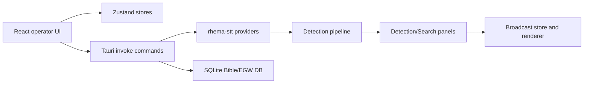

# Codebase Map - SabbathCue
Created: 2026-07-12 - Last verified: 2026-07-13 - Confidence: Medium

## 0 - Snapshot
| Field | Value |
|---|---|
| Purpose (one line) | Desktop app for real-time sermon transcription, Bible/EGW/hymn detection, and broadcast overlays. Receipt: README.md:7, README.md:9 |
| Primary language(s) / framework(s) | TypeScript/React frontend, Rust/Tauri backend. Receipt: package.json:83, package.json:127, src-tauri/Cargo.toml:55 |
| Repo shape | App monorepo with web UI, Tauri shell, Rust crates, data/docs/landing collateral. Receipt: package.json:6, src-tauri/Cargo.toml:30, README.md:253 |
| Entry points (count) | Vite app, Tauri app, Rust crates, landing/docs assets. Receipt: package.json:7, package.json:13, src-tauri/src/lib.rs:126 |
| Persistence | Tauri keyring/store, Zustand stores, SQLite Bible/EGW database. Receipt: src-tauri/Cargo.toml:57, src-tauri/Cargo.toml:70, src-tauri/Cargo.toml:75 |
| Deploy target | Tauri desktop app and public web/landing/docs content. Receipt: package.json:14, landing/index.html:544, web/content/docs/getting-started/speech-to-text.mdx:9 |

SabbathCue is a local-first Tauri desktop app for church media operators. The UI is React/Zustand, the native shell is Rust/Tauri, and live service workflows flow from STT into detection panels and broadcast-ready theme rendering.

## 1 - Purpose & context
SabbathCue listens to live sermon audio, transcribes it, detects scripture/EGW/hymn references, and renders operator-selected items as broadcast overlays. Receipt: README.md:9, README.md:40, README.md:53. Cloud STT is optional; local Vosk is the default path. Receipt: README.md:13, README.md:14, README.md:15.

## 2 - Tech stack
| Layer | Technology | Version | Receipt |
|---|---|---|---|
| Frontend | React | 19.2.7 | package.json:83 |
| Frontend build | Vite | 8.1.3 | package.json:7, package.json:127 |
| Desktop shell | Tauri | 2.10.3 | src-tauri/Cargo.toml:55 |
| Backend language | Rust | 1.77.2 minimum | src-tauri/Cargo.toml:37 |
| Testing | Vitest | 4.1.8 | package.json:16, package.json:128 |
| Data | SQLite via rusqlite | 0.34 | src-tauri/Cargo.toml:75 |
| STT | Vosk, Deepgram, Soniox | internal crate | src-tauri/crates/stt/src/lib.rs:3 |

## 3 - Architecture overview


Style and key patterns: React components read small Zustand selectors, Tauri commands expose native operations, and Rust crates hold provider/data logic. Receipts: src/stores/settings-store.ts:6, src-tauri/src/commands/stt/provider.rs:7, src-tauri/crates/stt/src/lib.rs:32.

Where the pattern is violated or watchlisted: the theme catalog still exports `KineticThemesPage` and keeps workspace id `kinetic-themes` while user-facing labels say "Themes", preserving persisted navigation compatibility. Receipt: src/components/broadcast/KineticThemesPage.tsx:132, src/components/broadcast/KineticThemesPage.tsx:170, src/lib/dashboard-workspace-nav.ts:69.

## 4 - Directory structure
| Path | Responsibility (verified by looking inside) | Notes |
|---|---|---|
| `/src/components` | React operator UI surfaces such as settings, detections, quick search, and broadcast themes. | Receipts: src/components/settings/sections/SpeechSection.tsx:465, src/components/panels/detections-panel.tsx:526, src/components/broadcast/KineticThemesPage.tsx:132 |
| `/src/stores` | Zustand state for settings, collected detections, Bible, broadcast, and UI state. | Receipts: src/stores/settings-store.ts:6, src/stores/collected-detections-store.ts:48 |
| `/src/lib` | Shared frontend logic, guards, search helpers, presentation workflow, rendering helpers. | Receipt: src/lib/quick-search.ts:167 |
| `/src-tauri/src/commands` | Tauri command layer for native features and STT orchestration. | Receipts: src-tauri/src/commands/stt/provider.rs:95, src-tauri/src/lib.rs:126 |
| `/src-tauri/crates/stt` | STT provider implementations and shared provider traits. | Receipts: src-tauri/crates/stt/src/lib.rs:27, src-tauri/crates/stt/src/lib.rs:32 |
| `/data` | Bible/EGW source conversion, validation, and SQLite import scripts. | Receipts: data/build-egw.ts:2, data/convert-egw-sc-pdf.ts:26, data/lib/egw-pdf-importer.ts:18 |
| `/landing` and `/web/content/docs` | Public marketing/docs content aligned with app capabilities. | Receipts: landing/index.html:544, web/content/docs/getting-started/speech-to-text.mdx:9 |

## 5 - Entry points & core modules
| Entry point | Location | What it starts |
|---|---|---|
| Vite dev app | package.json:7 | React app dev server |
| Tauri app | package.json:13 | Desktop shell and native command handlers |
| Tauri command registration | src-tauri/src/lib.rs:126 | Native commands including STT lifecycle |
| STT crate exports | src-tauri/crates/stt/src/lib.rs:32 | Deepgram, Soniox, and Vosk providers |

Core modules:
| Module | Location | Responsibility | Depended on by |
|---|---|---|---|
| Settings store | src/stores/settings-store.ts:6 | STT provider setting and cloud key status | Settings UI, transcript panel, transcription hook |
| STT provider routing | src-tauri/src/commands/stt/provider.rs:95 | Selects Vosk, Deepgram, or Soniox and handles removed providers | Tauri STT commands |
| Collected detections store | src/stores/collected-detections-store.ts:48 | Session-scoped reuse list of presented/queued detections | Detections panel |
| Detection actions | src/components/panels/detections-panel.tsx:144 | Shared preview/present/queue closures for detection types | Detection cards, latest bar, collection UI |
| Theme catalog page | src/components/broadcast/KineticThemesPage.tsx:132 | User-facing Themes workspace with static and kinetic columns | Workspace nav |
| Quick search helper | src/lib/quick-search.ts:167 | Prefix-safe ghost suggestion suffix | Preview and Search quick inputs |

## 6 - Traced flows
### Flow: STT provider selection
```text
Settings store type allows deepgram, soniox, vosk
  -> src/stores/settings-store.ts:6
Settings UI offers Soniox key controls
  -> src/components/settings/sections/SpeechSection.tsx:465
Backend route maps removed gladia to removed-provider error
  -> src-tauri/src/commands/stt/provider.rs:95
Backend constructs Deepgram, Soniox, or Vosk providers
  -> src-tauri/src/commands/stt/provider.rs:122
  -> src-tauri/src/commands/stt/provider.rs:148
  -> src-tauri/src/commands/stt/provider.rs:68
```

### Flow: collected detections
```text
Detection panel builds shared actions
  -> src/components/panels/detections-panel.tsx:144
Present/queue action records detection in session store
  -> src/stores/collected-detections-store.ts:51
Collected section reuses getDetectionActions for preview/live/queue
  -> src/components/panels/detections-panel.tsx:334
  -> src/components/panels/detections-panel.tsx:369
Section is rendered above detections list
  -> src/components/panels/detections-panel.tsx:526
```

### Flow: theme catalog
```text
Workspace nav id remains kinetic-themes but label is Themes
  -> src/lib/dashboard-workspace-nav.ts:69
Page reads useBroadcastThemeStore
  -> src/components/broadcast/KineticThemesPage.tsx:133
Theme designer library reads useBroadcastThemeDesignerStore alias
  -> src/components/broadcast/theme-library.tsx:2
Both aliases point to broadcast theme slice wrappers
  -> src/stores/broadcast/theme-store.ts:32
  -> src/stores/broadcast/theme-designer-store.ts:38
```

### Flow: quick-search ghost text
```text
Helper returns suffix only for non-empty case-insensitive prefix matches
  -> src/lib/quick-search.ts:167
Preview quick search uses helper before rendering ghost text
  -> src/components/panels/preview-quick-search.tsx:67
  -> src/components/panels/preview-quick-search.tsx:322
Search-panel quick search uses same helper
  -> src/components/panels/search/QuickVerseSearch.tsx:28
  -> src/components/panels/search/QuickVerseSearch.tsx:36
```

### Flow: Steps to Christ EGW source alignment
```text
SC PDF conversion reads the local Steps to Christ PDF
  -> data/convert-egw-sc-pdf.ts:24
Layout-aware importer reconstructs PDF paragraphs and printed page markers
  -> data/lib/egw-pdf-importer.ts:392
SC converter preserves EGW Writings-style paragraph bodies, applies the
verified poetry boundary fixes, then assigns page.paragraph labels
  -> data/convert-egw-sc-pdf.ts:70
  -> data/convert-egw-sc-pdf.ts:188
Build script imports the generated JSON into egw_books / egw_paragraphs
  -> data/build-egw.ts:2
```

### Flow: The Great Controversy EGW source alignment
```text
GC PDF conversion reads the local en_GC PDF with bracket citation markers
  -> data/convert-egw-gc-pdf.ts:49
Layout-aware importer treats bracket markers as citation pages
  -> data/lib/egw-pdf-importer.ts:442
GC converter preserves EGW Writings-style paragraph bodies and assigns
page.paragraph labels without counting continuation pages
  -> data/convert-egw-gc-pdf.ts:70
  -> data/convert-egw-gc-pdf.ts:71
Regression coverage locks the verified Chapter 1 visible-label sequence
  -> data/the-great-controversy-source.test.ts:27
Build script imports the generated JSON into egw_books / egw_paragraphs
  -> data/build-egw.ts:2
```

### Flow: Patriarchs and Prophets / Desire of Ages EGW source alignment
```text
PP and DA PDF converters read the local user-supplied PDFs with bracket
citation markers
  -> data/convert-egw-pp-pdf.ts:84
  -> data/convert-egw-da-pdf.ts:99
Both converters preserve EGW Writings-style paragraph bodies and assign
page.paragraph labels without counting continuation pages
  -> data/convert-egw-pp-pdf.ts:192
  -> data/convert-egw-pp-pdf.ts:193
  -> data/convert-egw-da-pdf.ts:219
  -> data/convert-egw-da-pdf.ts:220
Book-specific postprocessors repair verified Chapter 1 PDF extraction
artifacts before page.paragraph assignment
  -> data/convert-egw-pp-pdf.ts:131
  -> data/convert-egw-da-pdf.ts:153
Regression coverage locks the verified Chapter 1 visible-label sequences
  -> data/patriarchs-and-prophets-source.test.ts:27
  -> data/the-desire-of-ages-source.test.ts:27
Build script imports the generated JSON into egw_books / egw_paragraphs
  -> data/build-egw.ts:2
```

## 7 - Data model & persistence
| Entity | Storage | Key fields | Relationships | Defined at |
|---|---|---|---|---|
| STT settings | Tauri store plus Zustand hydration | sttProvider, key status booleans | Settings UI, transcription hook | src/stores/settings-store.ts:6, src/stores/settings-store.ts:188 |
| Cloud API keys | OS keyring via Tauri commands | Deepgram/Soniox key presence | STT provider routing | src-tauri/Cargo.toml:70, src/components/settings/sections/ApiKeysSection.tsx:5 |
| Collected detections | In-memory Zustand only | detection, source, kind, useCount, timestamps | Detections panel action reuse | src/stores/collected-detections-store.ts:20, src/stores/collected-detections-store.ts:85 |
| Broadcast themes | Broadcast Zustand slice | activeThemeId, themes, kinetic flag | Theme catalog and renderer | src/components/broadcast/KineticThemesPage.tsx:146, src/components/broadcast/theme-library.tsx:54 |
| Bible/EGW content | SQLite | translations, verses, EGW paragraphs | Search/detection/presentation | README.md:49, src-tauri/Cargo.toml:75 |
| EGW source JSON | data/sources/egw/*.json | book_number, chapter, paragraph, page, page_paragraph, text | Built into SQLite by `build:egw` | data/build-egw.ts:2, data/validate-egw-sources.ts:7 |

Migrations / schema management: not fully mapped in this pass. See open questions.

## 8 - Interfaces & integrations
Public interfaces:
| Interface | Type | Description | Auth | Defined at |
|---|---|---|---|---|
| Tauri commands | invoke | Native desktop operations and STT lifecycle | app session | src-tauri/src/lib.rs:126 |
| React workspace nav | UI route/state | Operator workspaces, including persisted `kinetic-themes` id | app session | src/lib/dashboard-workspace-nav.ts:69 |

External services:
| Service | Purpose | Criticality | Called from |
|---|---|---|---|
| Deepgram | Cloud STT | watch | src-tauri/crates/stt/src/lib.rs:11 |
| Soniox | Cloud STT | watch | src-tauri/crates/stt/src/lib.rs:12 |
| Vosk | Local STT worker/model | healthy | src-tauri/crates/stt/src/lib.rs:39 |

## 9 - Configuration & environments
| Variable / setting | Purpose | Required | Default | Read at |
|---|---|---|---|---|
| `sttProvider` | Selected STT backend | yes | Vosk-compatible fallback | src/stores/settings-store.ts:105 |
| Deepgram API key | Cloud STT auth | only for Deepgram | absent | src/stores/settings-store.ts:188 |
| Soniox API key | Cloud STT auth | only for Soniox | absent | src/stores/settings-store.ts:190 |
| Vosk model/worker resources | Local STT runtime | required for local STT | downloaded/bundled by scripts | src-tauri/tauri.conf.json:42, src-tauri/tauri.conf.json:44 |

Environments: development uses Vite/Tauri commands; release uses Tauri build and bundled public assets. Receipts: package.json:7, package.json:14, README.md:32.

## 10 - Build, run & test - commands that actually ran
```bash
npm.cmd run typecheck
# Result before edits: passed.
# Result after implementation: passed.

npm.cmd run test:unit
# Result before edits: 128 files passed, 934 tests passed, 1 skipped.
# Result after implementation: 131 files passed, 941 tests passed, 1 skipped.

npm.cmd run lint
# Result before edits: passed with existing complexity warning in data/lib/egw-pdf-importer.ts.
# Result after implementation: passed with the same existing complexity warning in data/lib/egw-pdf-importer.ts.

cargo test --workspace
# Result before edits: passed.
# Result after implementation: passed.

npx.cmd vitest run src/lib/quick-search.test.ts -t getGhostSuggestionSuffix
# Result before helper implementation: failed with TypeError: getGhostSuggestionSuffix is not a function.

npx.cmd vitest run src/lib/quick-search.test.ts src/components/panels/search/QuickVerseSearch.test.tsx src/components/panels/preview-quick-search.test.tsx
# Result after fix: 3 files passed, 46 tests passed.

npm.cmd run build
# Result after implementation: passed; Vite reported existing large chunk warning class.

git diff --check
# Result after implementation: passed; Git reported line-ending notices only.

bun test data/lib/egw-text-cleanup.test.ts data/lib/egw-paragraph-layout.test.ts data/steps-to-christ-source.test.ts
# Result after SC paragraph alignment: passed, 19 tests.

bun test data/lib/egw-text-cleanup.test.ts data/lib/egw-paragraph-layout.test.ts data/steps-to-christ-source.test.ts data/the-great-controversy-source.test.ts data/patriarchs-and-prophets-source.test.ts data/the-desire-of-ages-source.test.ts
# Result after PP/DA paragraph alignment: passed, 25 tests.

npm.cmd run validate:egw
# Result after SC paragraph alignment: passed; SC=273 paragraphs.
# Result after PP/DA paragraph alignment: passed; PP=2544, DA=2794, GC=1810 paragraphs.

npm.cmd run build:egw
# Result after SC paragraph alignment: passed; EGW import complete with 8,930 paragraphs.
# Result after PP/DA paragraph alignment: passed; EGW import complete with 8,732 paragraphs.
```

CI/CD & deployment: not fully mapped in this pass. See open questions.

## 11 - Quality, risks & tech debt
| Observation | Area | Severity | Receipt |
|---|---|---|---|
| Removed Gladia remains as a compatibility error branch and settings migration only. | maintainability | watch | src-tauri/src/commands/stt/provider.rs:95, src/stores/settings-store.ts:105 |
| Theme workspace id remains `kinetic-themes` while label is "Themes" to avoid persisted-state migration. | maintainability | watch | src/components/broadcast/KineticThemesPage.tsx:170, src/lib/dashboard-workspace-nav.ts:69 |
| Collected detections are intentionally session-only and capped at 50. | product behavior | healthy | src/stores/collected-detections-store.ts:25, src/stores/collected-detections-store.ts:85 |

Strengths: targeted stores and shared helpers make the current STT/detection/theme changes testable.

Top risks (ranked): 1. STT provider removal can leave stale docs or tests if historical text is edited indiscriminately. 2. Theme naming is user-facing while workspace id remains compatibility-facing. 3. Quick-search ghost text has two UI surfaces and should continue to share one helper.

## 12 - Onboarding notes
- Treat `kinetic-themes` as a stable workspace id, not the user-facing label.
- Do not grep-to-zero removed STT provider names across historical reports; compatibility tests may intentionally retain removed-provider strings.
- Collected detections should be recorded from present/queue actions, not preview-only actions.
- Quick-search ghost overlays must use `getGhostSuggestionSuffix` instead of local slicing.

## 13 - Open questions
- [ ] Full CI/CD and deployment flow is not mapped in this scoped pass.
- [ ] Full database build/migration ownership for Bible/EGW content is not mapped in this scoped pass.
- [ ] Full broadcast renderer path beyond theme selection is not mapped in this scoped pass.

## 14 - Glossary
| Term | Meaning |
|---|---|
| STT | Speech-to-text provider layer. |
| Vosk | Local/offline STT provider and worker. |
| Deepgram | Cloud STT provider. |
| Soniox | Cloud STT provider. |
| Kinetic theme | Theme with moving background data. |
| Collected detection | Session-scoped item captured when an operator presents or queues a detection. |

## 15 - Map changelog
| Date | Change | Sections touched |
|---|---|---|
| 2026-07-12 | Initial scoped map for STT cleanup, collected detections, theme catalog, and quick-search ghost text work. | 0-15 |
| 2026-07-13 | Added EGW source-generation map for Steps to Christ paragraph/page alignment. | 4, 6, 7, 10, 15 |
