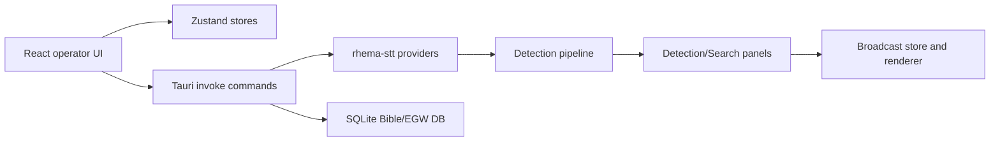

# Codebase Map - SabbathCue
Created: 2026-07-12 - Last verified: 2026-07-19 - Confidence: Medium

## 0 - Snapshot
| Field | Value |
|---|---|
| Purpose (one line) | Desktop app for real-time sermon transcription, Bible/EGW/hymn detection, and broadcast overlays. Receipt: README.md:7, README.md:9 |
| Primary language(s) / framework(s) | TypeScript/React frontend, Rust/Tauri backend. Receipt: package.json:83, package.json:127, src-tauri/Cargo.toml:55 |
| Repo shape | App monorepo with web UI, Tauri shell, Rust crates, data/docs/landing collateral. Receipt: package.json:6, src-tauri/Cargo.toml:30, README.md:253 |
| Entry points (count) | Vite app, Tauri app, Rust crates, landing/docs assets. Receipt: package.json:7, package.json:13, src-tauri/src/lib.rs:126 |
| Persistence | Tauri keyring/store, Zustand stores, SQLite Bible/EGW database. Receipt: src-tauri/Cargo.toml:57, src-tauri/Cargo.toml:70, src-tauri/Cargo.toml:75 |
| Deploy target | Tauri desktop app and public web/landing/docs content. Receipt: package.json:14, landing/index.html:544, web/content/docs/getting-started/speech-to-text.mdx:9 |

SabbathCue is a local-first Tauri desktop app for church media operators. The UI is React/Zustand, the native shell is Rust/Tauri, and live service workflows flow from STT into detection panels and broadcast-ready theme rendering.

## 1 - Purpose & context
SabbathCue listens to live sermon audio, transcribes it, detects scripture/EGW/hymn references, and renders operator-selected items as broadcast overlays. Receipt: README.md:9, README.md:40, README.md:53. Cloud STT is optional; local Vosk is the default path. Receipt: README.md:13, README.md:14, README.md:15.

## 2 - Tech stack
| Layer | Technology | Version | Receipt |
|---|---|---|---|
| Frontend | React | 19.2.7 | package.json:83 |
| Frontend build | Vite | 8.1.3 | package.json:7, package.json:127 |
| Desktop shell | Tauri | 2.10.3 | src-tauri/Cargo.toml:55 |
| Backend language | Rust | 1.77.2 minimum | src-tauri/Cargo.toml:37 |
| Testing | Vitest | 4.1.8 | package.json:16, package.json:128 |
| Data | SQLite via rusqlite | 0.34 | src-tauri/Cargo.toml:75 |
| STT | Vosk, Deepgram, Soniox, Speechmatics | internal crate | src-tauri/crates/stt/src/lib.rs:3 |

## 3 - Architecture overview


Style and key patterns: React components read small Zustand selectors, Tauri commands expose native operations, and Rust crates hold provider/data logic. Receipts: src/stores/settings-store.ts:6, src-tauri/src/commands/stt/provider.rs:7, src-tauri/crates/stt/src/lib.rs:32.

Where the pattern is violated or watchlisted: the theme catalog still exports `KineticThemesPage` and keeps workspace id `kinetic-themes` while user-facing labels say "Themes", preserving persisted navigation compatibility. Receipt: src/components/broadcast/KineticThemesPage.tsx:132, src/components/broadcast/KineticThemesPage.tsx:170, src/lib/dashboard-workspace-nav.ts:69.

## 4 - Directory structure
| Path | Responsibility (verified by looking inside) | Notes |
|---|---|---|
| `/src/components` | React operator UI surfaces such as settings, detections, quick search, and broadcast themes. | Receipts: src/components/settings/sections/SpeechSection.tsx:465, src/components/panels/detections-panel.tsx:526, src/components/broadcast/KineticThemesPage.tsx:132 |
| `/src/stores` | Zustand state for settings, collected detections, Bible, broadcast, and UI state. | Receipts: src/stores/settings-store.ts:6, src/stores/collected-detections-store.ts:48 |
| `/src/lib` | Shared frontend logic, guards, search helpers, presentation workflow, rendering helpers. | Receipt: src/lib/quick-search.ts:167 |
| `/src-tauri/src/commands` | Tauri command layer for native features and STT orchestration. | Receipts: src-tauri/src/commands/stt/provider.rs:95, src-tauri/src/lib.rs:126 |
| `/src-tauri/crates/stt` | STT provider implementations and shared provider traits. | Receipts: src-tauri/crates/stt/src/lib.rs:27, src-tauri/crates/stt/src/lib.rs:32 |
| `/data` | Bible/EGW source conversion, validation, and SQLite import scripts. | Receipts: data/build-egw.ts:2, data/convert-egw-sc-pdf.ts:26, data/lib/egw-pdf-importer.ts:18 |
| `/landing`, `/landing-knfcpilot`, and `/web/content/docs` | Public marketing/docs content. `landing/knfc.html` is the canonical KNFC pilot page; `landing-knfcpilot/index.html` is its standalone Vercel deployment copy and reuses the KNFC logo and product-demo video from `landing/assets`. | Receipts: landing/knfc.html:7, landing/knfc.html:296, landing-knfcpilot/.vercel/project.json:1, scripts/vercel-build.mjs:4, web/content/docs/getting-started/speech-to-text.mdx:9 |

## 5 - Entry points & core modules
| Entry point | Location | What it starts |
|---|---|---|
| Vite dev app | package.json:7 | React app dev server |
| Tauri app | package.json:13 | Desktop shell and native command handlers |
| Tauri command registration | src-tauri/src/lib.rs:126 | Native commands including STT lifecycle |
| STT crate exports | src-tauri/crates/stt/src/lib.rs:32 | Deepgram, Soniox, Speechmatics, and Vosk providers |
| KNFC static deployment | landing-knfcpilot/index.html:1 | Static landing page linked to Vercel project `knfcpilot` |

Core modules:
| Module | Location | Responsibility | Depended on by |
|---|---|---|---|
| Settings store | src/stores/settings-store.ts:6 | STT provider setting and cloud key status | Settings UI, transcript panel, transcription hook |
| Verification store | src/stores/verification-store.ts:20 | Bounds startup/session refresh checks and exposes auth state | Verification gate and sign-in screen |
| Verification provider | src/lib/verification/verification-provider.ts:191 | Restores sessions, clears expired credentials, and verifies device access | Verification store and heartbeat |
| Supabase account profile | supabase/migrations/008_church_organization_profiles.sql:4 | Stores optional self-declared church organization identity and exposes it through device/admin RPCs | Signup, verification session, operator badge, admin account list |
| Device activation boundary | supabase/functions/device-activation/index.ts:178 | Verifies installation-key signatures, invokes service-role-only activation RPCs, and signs offline leases | Verification provider and account device management |
| Installation identity | src-tauri/src/commands/installation_identity.rs:1 | Owns the P-256 private key in the OS keychain and exposes public identity/challenge signing | Device registration and approval |
| STT provider routing | src-tauri/src/commands/stt/provider.rs:95 | Selects Vosk, Deepgram, or Soniox and handles removed providers | Tauri STT commands |
| Collected detections store | src/stores/collected-detections-store.ts:48 | Session-scoped reuse list of presented/queued detections | Detections panel |
| Detection actions | src/components/panels/detections-panel.tsx:144 | Shared preview/present/queue closures for detection types | Detection cards, latest bar, collection UI |
| Theme catalog page | src/components/broadcast/KineticThemesPage.tsx:132 | User-facing Themes workspace with static and kinetic columns | Workspace nav |
| Quick search helper | src/lib/quick-search.ts:167 | Prefix-safe ghost suggestion suffix | Preview and Search quick inputs |

## 6 - Traced flows
### Flow: startup authentication and expired-session handling
```text
main starts verification hydration without blocking first paint
  -> src/main.tsx:52
Verification store bounds startup and retry checks to 15 seconds
  -> src/stores/verification-store.ts:14
  -> src/stores/verification-store.ts:20
Provider restores the saved Supabase session and verifies device access
  -> src/lib/verification/verification-provider.ts:191
Rejected refresh tokens clear token plus metadata and return required
  -> src/lib/verification/verification-provider.ts:200
Verification gate renders the sign-in screen for required/error states
  -> src/components/verification/VerificationGate.tsx:22
```

### Flow: self-declared church organization signup and badges
```text
Trial signup optionally collects a church organization name and validates 2-120 characters
  -> src/components/verification/VerificationScreen.tsx:313
  -> src/components/verification/VerificationScreen.tsx:826
Supabase signup metadata is copied into account_flags by the new-user trigger
  -> src/lib/supabase/auth.ts:93
  -> supabase/migrations/008_church_organization_profiles.sql:23
Device registration returns the canonical profile into the verified desktop session
  -> supabase/migrations/008_church_organization_profiles.sql:64
  -> src/lib/supabase/devices.ts:58
The operator strip renders the church badge and admins receive the same fields in their account list
  -> src/components/layout/operator-status-strip.tsx:38
  -> supabase/migrations/008_church_organization_profiles.sql:166
  -> src/components/settings/sections/AccountSection.tsx:173
```

### Flow: approved-computer activation and signed offline lease
```text
Native command creates or restores a P-256 installation key in the OS credential manager
and preserves an existing verification.json device ID during migration
  -> src-tauri/src/commands/installation_identity.rs:1
  -> src/lib/verification/device-id.ts:64
Registration and existing-computer approval sign action-specific, timestamped challenges
  -> src/lib/supabase/devices.ts:179
  -> src/lib/supabase/devices.ts:224
Authenticated Edge Function verifies the caller JWT and installation signature, then calls
service-role-only register/approve RPCs
  -> supabase/functions/device-activation/index.ts:178
  -> supabase/migrations/009_device_activation_management.sql:32
  -> supabase/migrations/009_device_activation_management.sql:162
Successful registration returns a signed lease with a 72-hour default and admin policy
choices of 24, 72, or 168 hours
  -> supabase/functions/device-activation/index.ts:135
  -> supabase/migrations/009_device_activation_management.sql:203
Offline startup verifies signature, user, device, account expiry, and lease expiry before access
  -> src/lib/verification/activation-lease.ts:51
  -> src/lib/verification/verification-provider.ts:231
Heartbeat classifies suspension, expiry, pending, revoked, identity mismatch, and device limit
as blocking responses
  -> src/lib/verification/verification-provider.ts:335
  -> src/lib/verification/verification-provider.ts:374
```

### Flow: STT provider selection
```text
Settings store type allows deepgram, soniox, speechmatics, vosk
  -> src/stores/settings-store.ts:6
Settings UI offers Soniox key controls
  -> src/components/settings/sections/SpeechSection.tsx:465
Backend route maps removed gladia to removed-provider error
  -> src-tauri/src/commands/stt/provider.rs:95
Backend constructs Deepgram, Soniox, Speechmatics, or Vosk providers
  -> src-tauri/src/commands/stt/provider.rs:122
  -> src-tauri/src/commands/stt/provider.rs:148
  -> src-tauri/src/commands/stt/provider.rs:68
```

### Flow: Speechmatics visible transcript coalescing
```text
Rust transcript payload includes the active provider
  -> src-tauri/src/events.rs:23
  -> src-tauri/src/commands/stt/mod.rs:398
  -> src-tauri/src/commands/stt/mod.rs:482
Final payload is appended to the transcript store immediately
  -> src/hooks/use-transcription.ts:243
The store coalesces only adjacent Speechmatics finals arriving within 4 seconds
  -> src/stores/transcript-store.ts:6
  -> src/stores/transcript-store.ts:45
Deepgram, Soniox, Vosk, and Speechmatics spans after a longer pause remain separate rows
  -> src/hooks/use-transcription.test.ts:476
```

### Flow: collected detections
```text
Detection panel builds shared actions
  -> src/components/panels/detections-panel.tsx:144
Present/queue action records detection in session store
  -> src/stores/collected-detections-store.ts:51
Collected section reuses getDetectionActions for preview/live/queue
  -> src/components/panels/detections-panel.tsx:334
  -> src/components/panels/detections-panel.tsx:369
Section is rendered above detections list
  -> src/components/panels/detections-panel.tsx:526
```

### Flow: theme catalog
```text
Workspace nav id remains kinetic-themes but label is Themes
  -> src/lib/dashboard-workspace-nav.ts:69
Page reads useBroadcastThemeStore
  -> src/components/broadcast/KineticThemesPage.tsx:133
Theme designer library reads useBroadcastThemeDesignerStore alias
  -> src/components/broadcast/theme-library.tsx:2
Both aliases point to broadcast theme slice wrappers
  -> src/stores/broadcast/theme-store.ts:32
  -> src/stores/broadcast/theme-designer-store.ts:38
```

### Flow: quick-search ghost text
```text
Helper returns suffix only for non-empty case-insensitive prefix matches
  -> src/lib/quick-search.ts:167
Preview quick search uses helper before rendering ghost text
  -> src/components/panels/preview-quick-search.tsx:67
  -> src/components/panels/preview-quick-search.tsx:322
Search-panel quick search uses same helper
  -> src/components/panels/search/QuickVerseSearch.tsx:28
  -> src/components/panels/search/QuickVerseSearch.tsx:36
```

### Flow: KNFC landing deployment
```text
Canonical KNFC marketing copy is maintained in landing/knfc.html
  -> landing/knfc.html:1
Standalone deployment copy is landing-knfcpilot/index.html
  -> landing-knfcpilot/index.html:1
The standalone folder is linked to Vercel project knfcpilot
  -> landing-knfcpilot/.vercel/project.json:1
Repo-root Vercel builds for project knfcsabbathcue copy that same standalone page into dist
  -> scripts/vercel-build.mjs:4
  -> vercel.json:4
```

### Flow: Steps to Christ EGW source alignment
```text
SC PDF conversion reads the local Steps to Christ PDF
  -> data/convert-egw-sc-pdf.ts:24
Layout-aware importer reconstructs PDF paragraphs and printed page markers
  -> data/lib/egw-pdf-importer.ts:392
SC converter preserves EGW Writings-style paragraph bodies, applies the
verified poetry boundary fixes, then assigns page.paragraph labels
  -> data/convert-egw-sc-pdf.ts:70
  -> data/convert-egw-sc-pdf.ts:188
Build script imports the generated JSON into egw_books / egw_paragraphs
  -> data/build-egw.ts:2
```

### Flow: The Great Controversy EGW source alignment
```text
GC PDF conversion reads the local en_GC PDF with bracket citation markers
and the supplied PDF's visible folio page sequence
  -> data/convert-egw-gc-pdf.ts:49
Shared PDF importer keeps a canonical citation-marker stream for paragraph
cleanup and a separate folio stream for output page labels
  -> data/lib/egw-pdf-importer.ts:281
  -> data/lib/egw-pdf-importer.ts:628
GC converter preserves EGW Writings-style paragraph bodies, assigns supplied
PDF folio page.paragraph labels, and does not count continuation pages
  -> data/convert-egw-gc-pdf.ts:66
  -> data/convert-egw-gc-pdf.ts:74
Regression coverage locks the verified Chapter 1 folio-label sequence
  -> data/the-great-controversy-source.test.ts:30
Build script imports the generated JSON into egw_books / egw_paragraphs
  -> data/build-egw.ts:2
```

### Flow: Patriarchs and Prophets / Desire of Ages / Education EGW source alignment
```text
PP, DA, and Education PDF converters read the local user-supplied PDFs with bracket
citation markers and visible folio page sequences
  -> data/convert-egw-pp-pdf.ts:84
  -> data/convert-egw-da-pdf.ts:99
  -> data/convert-egw-ed-pdf.ts:46
These converters preserve EGW Writings-style paragraph bodies and use the
shared two-stream folio mode to assign the supplied PDFs' visible folio page
labels without counting continuation pages
  -> data/convert-egw-pp-pdf.ts:181
  -> data/convert-egw-da-pdf.ts:206
  -> data/convert-egw-ed-pdf.ts:132
  -> data/convert-egw-pp-pdf.ts:185
  -> data/convert-egw-da-pdf.ts:219
  -> data/convert-egw-ed-pdf.ts:133
  -> data/convert-egw-da-pdf.ts:220
Book-specific postprocessors repair verified PDF extraction
artifacts before page.paragraph assignment
  -> data/convert-egw-pp-pdf.ts:130
  -> data/convert-egw-da-pdf.ts:153
  -> data/convert-egw-ed-pdf.ts:92
Regression coverage locks the verified visible-label sequences and chapter
start folios
  -> data/patriarchs-and-prophets-source.test.ts:30
  -> data/the-desire-of-ages-source.test.ts:27
  -> data/education-source.test.ts:30
  -> data/education-source.test.ts:88
  -> data/education-source.test.ts:109
Build script imports the generated JSON into egw_books / egw_paragraphs
  -> data/build-egw.ts:2
```

## 7 - Data model & persistence
| Entity | Storage | Key fields | Relationships | Defined at |
|---|---|---|---|---|
| STT settings | Tauri store plus Zustand hydration | sttProvider, key status booleans | Settings UI, transcription hook | src/stores/settings-store.ts:6, src/stores/settings-store.ts:188 |
| Cloud API keys | OS keyring via Tauri commands | Deepgram/Soniox/Speechmatics key presence and validation | STT provider routing | src-tauri/Cargo.toml:70, src/components/settings/sections/ApiKeysSection.tsx:5 |
| Collected detections | In-memory Zustand only | detection, source, kind, useCount, timestamps | Detections panel action reuse | src/stores/collected-detections-store.ts:20, src/stores/collected-detections-store.ts:85 |
| Broadcast themes | Broadcast Zustand slice | activeThemeId, themes, kinetic flag | Theme catalog and renderer | src/components/broadcast/KineticThemesPage.tsx:146, src/components/broadcast/theme-library.tsx:54 |
| Bible/EGW content | SQLite | translations, verses, EGW paragraphs | Search/detection/presentation | README.md:49, src-tauri/Cargo.toml:75 |
| EGW source JSON | data/sources/egw/*.json | book_number, chapter, paragraph, page, page_paragraph, text | Built into SQLite by `build:egw` | data/build-egw.ts:2, data/validate-egw-sources.ts:7 |
| Account flags | Supabase Postgres | user_id, access_expires_at, suspended, is_church_organization, church_name | Auth user, registered devices, admin account list | supabase/migrations/008_church_organization_profiles.sql:4 |
| Device activations | Supabase Postgres | user_id, device_id, public_key, status, first/last seen, approved/revoked timestamps | Account, installation identity, admin/user management | supabase/migrations/009_device_activation_management.sql:4 |
| Signed activation lease | Tauri store, verified against build-time public key | payload, signature, user/device binding, issued/expires/access expiry | Offline verification session | src/lib/verification/activation-lease.ts:1, src/lib/verification/session-storage.ts:21 |

Account/access schema changes are versioned in `/supabase/migrations`; migration 008 extends the existing trial/device/admin RPC contract with the optional church organization profile. Receipt: supabase/migrations/008_church_organization_profiles.sql:1.

## 8 - Interfaces & integrations
Public interfaces:
| Interface | Type | Description | Auth | Defined at |
|---|---|---|---|---|
| Tauri commands | invoke | Native desktop operations and STT lifecycle | app session | src-tauri/src/lib.rs:126 |
| React workspace nav | UI route/state | Operator workspaces, including persisted `kinetic-themes` id | app session | src/lib/dashboard-workspace-nav.ts:69 |

External services:
| Service | Purpose | Criticality | Called from |
|---|---|---|---|
| Deepgram | Cloud STT | watch | src-tauri/crates/stt/src/lib.rs:11 |
| Soniox | Cloud STT | watch | src-tauri/crates/stt/src/lib.rs:12 |
| Speechmatics | Cloud STT | watch | src-tauri/crates/stt/src/speechmatics.rs:17 |
| Vosk | Local STT worker/model | healthy | src-tauri/crates/stt/src/lib.rs:39 |
| Supabase | Account auth, trial/device access, optional church profile, admin account listing | critical | src/lib/supabase/client.ts:6, supabase/migrations/008_church_organization_profiles.sql:23 |
| Supabase Edge Function | Installation proof verification and signed activation lease issuance | critical | supabase/functions/device-activation/index.ts:178 |

## 9 - Configuration & environments
| Variable / setting | Purpose | Required | Default | Read at |
|---|---|---|---|---|
| `sttProvider` | Selected STT backend | yes | Vosk-compatible fallback | src/stores/settings-store.ts:105 |
| Deepgram endpointing | Finalize after a short speech pause | only for Deepgram | 250 ms | src-tauri/crates/stt/src/deepgram.rs:23 |
| Speechmatics max delay | Upper target for final transcript latency, with flexible entity formatting | only for Speechmatics | 1.0 second | src-tauri/crates/stt/src/speechmatics.rs:22, src-tauri/crates/stt/src/speechmatics.rs:180 |
| Deepgram API key | Cloud STT auth | only for Deepgram | absent | src/stores/settings-store.ts:188 |
| Soniox API key | Cloud STT auth | only for Soniox | absent | src/stores/settings-store.ts:190 |
| Speechmatics API key | Cloud STT auth | only for Speechmatics | absent | src/stores/settings-store.ts:198 |
| Vosk model/worker resources | Local STT runtime | required for local STT | downloaded/bundled by scripts | src-tauri/tauri.conf.json:42, src-tauri/tauri.conf.json:44 |
| `VITE_SUPABASE_URL`, `VITE_SUPABASE_ANON_KEY` | Supabase account/auth client | required for account-enabled builds | absent | src/lib/supabase/client.ts:6 |
| `VITE_ACTIVATION_LEASE_PUBLIC_KEY` | Verify server-signed offline leases | required for offline access | absent | src/lib/verification/activation-lease.ts:94 |
| `ACTIVATION_LEASE_PRIVATE_KEY` | Sign offline leases in the Edge Function | required in Supabase Function secrets | absent | supabase/functions/device-activation/index.ts:64 |

Environments: development uses Vite/Tauri commands; release uses Tauri build and bundled public assets. Receipts: package.json:7, package.json:14, README.md:32.

## 10 - Build, run & test - commands that actually ran
```bash
npm.cmd run typecheck
# Result before edits: passed.
# Result after implementation: passed.

npm.cmd run test:unit
# Result before edits: 128 files passed, 934 tests passed, 1 skipped.
# Result after implementation: 131 files passed, 941 tests passed, 1 skipped.
# Result after church organization signup/profile implementation: 134 files passed, 964 tests passed, 1 skipped.
# Result after approved-computer activation hardening: 136 files passed, 981 tests passed, 1 skipped.

npm.cmd run lint
# Result before edits: passed with existing complexity warning in data/lib/egw-pdf-importer.ts.
# Result after implementation: passed with the same existing complexity warning in data/lib/egw-pdf-importer.ts.
# Result after church organization signup/profile implementation: passed with three existing data/test complexity warnings and no errors.
# Result after approved-computer activation hardening: passed with the same three existing data/test complexity warnings and no new warnings.

cargo test --workspace
# Result before edits: passed.
# Result after implementation: passed.

npx.cmd vitest run src/lib/quick-search.test.ts -t getGhostSuggestionSuffix
# Result before helper implementation: failed with TypeError: getGhostSuggestionSuffix is not a function.

npx.cmd vitest run src/lib/quick-search.test.ts src/components/panels/search/QuickVerseSearch.test.tsx src/components/panels/preview-quick-search.test.tsx
# Result after fix: 3 files passed, 46 tests passed.

npm.cmd run build
# Result after implementation: passed; Vite reported existing large chunk warning class.
# Result after church organization signup/profile implementation: passed; Vite reported the existing large chunk warning class.
# Result after approved-computer activation hardening: passed; Vite reported the existing large chunk warning class.

git diff --check
# Result after implementation: passed; Git reported line-ending notices only.

bun test data/lib/egw-text-cleanup.test.ts data/lib/egw-paragraph-layout.test.ts data/steps-to-christ-source.test.ts
# Result after SC paragraph alignment: passed, 19 tests.

bun test data/lib/egw-text-cleanup.test.ts data/lib/egw-paragraph-layout.test.ts data/steps-to-christ-source.test.ts data/the-great-controversy-source.test.ts data/patriarchs-and-prophets-source.test.ts data/the-desire-of-ages-source.test.ts
# Result after PP/DA paragraph alignment: passed, 25 tests.

bun test data/lib/egw-text-cleanup.test.ts data/lib/egw-paragraph-layout.test.ts data/lib/egw-pdf-importer.test.ts data/steps-to-christ-source.test.ts data/the-great-controversy-source.test.ts data/patriarchs-and-prophets-source.test.ts data/the-desire-of-ages-source.test.ts data/education-source.test.ts
# Result after Education folio alignment: passed, 43 tests.

npm.cmd run validate:egw
# Result after SC paragraph alignment: passed; SC=273 paragraphs.
# Result after PP/DA paragraph alignment: passed; PP=2544, DA=2794, GC=1810 paragraphs.
# Result after Education folio alignment: passed; Ed=1310 paragraphs.

npm.cmd run build:egw
# Result after SC paragraph alignment: passed; EGW import complete with 8,930 paragraphs.
# Result after PP/DA paragraph alignment: passed; EGW import complete with 8,732 paragraphs.
# Result after Education folio alignment: passed; EGW import complete with 8,731 paragraphs.
```

KNFC deployment is mapped above; broader app/docs CI/CD remains only partially mapped. See open questions.

## 11 - Quality, risks & tech debt
| Observation | Area | Severity | Receipt |
|---|---|---|---|
| Removed Gladia remains as a compatibility error branch and settings migration only. | maintainability | watch | src-tauri/src/commands/stt/provider.rs:95, src/stores/settings-store.ts:105 |
| Theme workspace id remains `kinetic-themes` while label is "Themes" to avoid persisted-state migration. | maintainability | watch | src/components/broadcast/KineticThemesPage.tsx:170, src/lib/dashboard-workspace-nav.ts:69 |
| Collected detections are intentionally session-only and capped at 50. | product behavior | healthy | src/stores/collected-detections-store.ts:25, src/stores/collected-detections-store.ts:85 |

Strengths: targeted stores and shared helpers make the current STT/detection/theme changes testable.

Top risks (ranked): 1. STT provider removal can leave stale docs or tests if historical text is edited indiscriminately. 2. Theme naming is user-facing while workspace id remains compatibility-facing. 3. Quick-search ghost text has two UI surfaces and should continue to share one helper.

## 12 - Onboarding notes
- Treat `kinetic-themes` as a stable workspace id, not the user-facing label.
- Do not grep-to-zero removed STT provider names across historical reports; compatibility tests may intentionally retain removed-provider strings.
- Collected detections should be recorded from present/queue actions, not preview-only actions.
- Quick-search ghost overlays must use `getGhostSuggestionSuffix` instead of local slicing.

## 13 - Open questions
- [ ] Full desktop-app and documentation CI/CD is not mapped in this scoped pass; the KNFC Vercel static deployment is mapped.
- [ ] Full database build/migration ownership for Bible/EGW content is not mapped in this scoped pass.
- [ ] Full broadcast renderer path beyond theme selection is not mapped in this scoped pass.

## 14 - Glossary
| Term | Meaning |
|---|---|
| STT | Speech-to-text provider layer. |
| Vosk | Local/offline STT provider and worker. |
| Deepgram | Cloud STT provider. |
| Soniox | Cloud STT provider. |
| Kinetic theme | Theme with moving background data. |
| Collected detection | Session-scoped item captured when an operator presents or queues a detection. |

## 15 - Map changelog
| Date | Change | Sections touched |
|---|---|---|
| 2026-07-12 | Initial scoped map for STT cleanup, collected detections, theme catalog, and quick-search ghost text work. | 0-15 |
| 2026-07-13 | Added EGW source-generation map for Steps to Christ paragraph/page alignment. | 4, 6, 7, 10, 15 |
| 2026-07-15 | Added bounded startup-auth and automatic expired-session sign-in flow. | 5, 6, 15 |
| 2026-07-15 | Added provider-specific cloud-key onboarding and validation plus Speechmatics real-time transcription. | 2, 5-9, 15 |
| 2026-07-16 | Added provider-aware visible transcript coalescing for adjacent Speechmatics final spans without delaying detection. | 6, 15 |
| 2026-07-16 | Tuned Deepgram endpointing to 250 ms and Speechmatics flexible final delay to 1.0 second. | 9, 15 |
| 2026-07-16 | Added optional self-declared church organization signup metadata, verified-session/operator badge display, and admin account visibility. | 5-10, 15 |
| 2026-07-16 | Replaced UUID-only device counting with managed approved/pending/revoked activations, OS-keychain P-256 identity proof, service-role-only registration/approval, and signed configurable offline leases. | 5-11, 15 |
| 2026-07-19 | Mapped the dedicated KNFC pilot landing entry point and its local visual/demo assets after the cinematic product-story redesign. | 4, 15 |
| 2026-07-19 | Traced the standalone `knfcpilot` Vercel folder and repo-root static build branch, and aligned the KNFC copy with verified app behavior. | 4-6, 10, 13, 15 |
