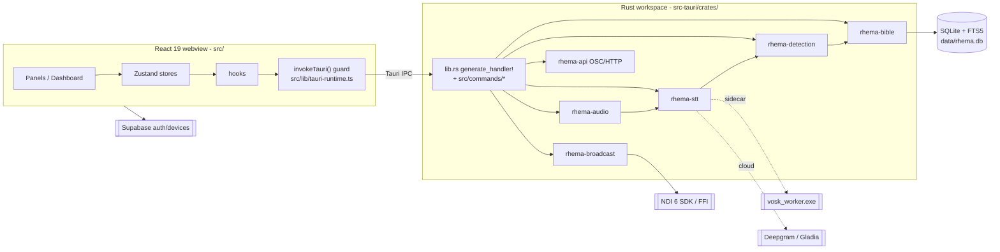

# Codebase Understanding Report — SabbathCue (rhema)

> Evidence-based assessment. Every claim below is backed by a file reference or a
> command that was executed against the working tree, with its result quoted.
> Verification commands were run on 2026-06-17 against branch `whisper-stt-powerpoint`.
>
> **2026-06-24 follow-up:** The body below is the 2026-06-17 architecture snapshot.
> Current maintainability findings and refactor-branch status live in
> [CODE_QUALITY_REPORT.md](reports/CODE_QUALITY_REPORT.md).

Legend: 🔴 high risk · 🟡 watch · 🟢 healthy

---

## 0. Snapshot

| Field | Value |
| --- | --- |
| Project name | SabbathCue (package name `sabbathcue`; repo/working dir `rhema`) |
| Repository / URL | <https://github.com/Bongisto/SabbathCue> ([src-tauri/Cargo.toml:35](../src-tauri/Cargo.toml#L35)) |
| Primary language(s) | TypeScript (~93.7k LOC across 312 files in `src/`), Rust (~26.6k LOC across 94 files in `src-tauri/`) |
| Framework(s) | Tauri v2 desktop shell; React 19 + Vite frontend; Next.js (Fumadocs) for `web/` docs site |
| Reviewer | Claude (automated, tool-verified) |
| Date started / completed | 2026-06-17 |
| Report version | v1.0 |
| Confidence level | **High** for build/test/lint state (commands executed below); Medium for runtime/operator behavior (not exercised against live audio/NDI hardware) |

### One-paragraph summary

> SabbathCue is a local-first Tauri v2 desktop app that listens to live sermon audio, transcribes
> it in real time, detects Bible verse references (explicit citations + quoted passages via an
> Aho-Corasick + fuzzy + ONNX-semantic ensemble), and renders broadcast-ready overlays out over NDI.
> The codebase is **healthy and genuinely production-oriented**: as of this review the full local
> verification chain passes — TypeScript typecheck (exit 0), ESLint (exit 0), 555 frontend unit tests
> across 79 files (all passing), and the Rust workspace builds and tests clean (`cargo check` and
> `cargo test --workspace` both exit 0). The single most important thing a new engineer should know:
> the product splits cleanly into a **6-crate Rust backend** (`src-tauri/crates/`) and a
> **feature-foldered React frontend** (`src/`) connected only through Tauri IPC commands — understand
> that seam ([src/lib/tauri-runtime.ts](../src/lib/tauri-runtime.ts) ↔ [src-tauri/src/lib.rs](../src-tauri/src/lib.rs)) and the rest follows.

---

## 1. Purpose & Context

- **Problem solved:** real-time, AI-assisted Bible-verse detection and broadcast overlay generation for live sermons/broadcasts ([README.md:9](../README.md#L9)).
- **Users:** live-production operators in a church/broadcast setting (operator dashboard, go-live, queue, NDI output).
- **In scope:** local speech-to-text, multi-strategy verse detection, SQLite Bible DB with FTS5, theme/overlay designer, NDI output, hymnal + sermon-slide + service-plan presentation modes, OSC/HTTP remote control, Supabase account/device gating.
- **Out of scope / optional:** cloud STT (Deepgram/Gladia), NDI SDK binaries (not bundled in the free public installer) — these are user-configured integrations ([README.md:13-16](../README.md#L13-L16)).
- **Distribution model:** local-first, free public installer ships redistributable (public-domain) Bible content + local STT only; licensed translations (NIV/ESV/NASB/NKJV/NLT/AMP) are private/dev-build only ([README.md:50](../README.md#L50)).

---

## 2. Tech Stack

| Layer | Technology | Version | Notes / Evidence |
| --- | --- | --- | --- |
| Language (frontend) | TypeScript | ~5.9.3 | [package.json:109](../package.json#L109) |
| Language (backend) | Rust | edition 2021, min 1.77.2 | [src-tauri/Cargo.toml:36-37](../src-tauri/Cargo.toml#L36-L37) |
| UI framework | React | 19.2.4 | [package.json:74](../package.json#L74) |
| Desktop shell | Tauri | v2 (tauri 2.10.3) | [src-tauri/Cargo.toml:55](../src-tauri/Cargo.toml#L55) |
| State | Zustand | 5.0.12 | [package.json:82](../package.json#L82) |
| Build / tooling | Vite 8 (override), Bun (scripts + pkg mgr) | vite ^8.0.16 | [package.json:86](../package.json#L86), [README.md:89](../README.md#L89) |
| Styling | Tailwind CSS v4 + shadcn/ui + radix-ui | tailwind ^4.2.1 | [package.json:80](../package.json#L80) |
| Database | SQLite via rusqlite (bundled) + FTS5 | rusqlite 0.34 | [src-tauri/Cargo.toml:80](../src-tauri/Cargo.toml#L80), [README.md:49](../README.md#L49) |
| AI/ML | ONNX Runtime (MiniLM-L6-v2 embeddings), Aho-Corasick, Fuse.js | — | [README.md:71](../README.md#L71) |
| STT (local) | Whisper (default Cargo feature), Vosk worker sidecar | — | [src-tauri/Cargo.toml:75](../src-tauri/Cargo.toml#L75), `sidecars/vosk_worker.exe` |
| STT (cloud, optional) | Deepgram (WS+REST), Gladia | — | [README.md:74](../README.md#L74) |
| Broadcast | NDI 6 SDK via dynamic loading (libloading FFI) | — | [README.md:73](../README.md#L73) |
| Auth/backend service | Supabase (email/password + device registration) | @supabase/supabase-js ^2.108.1 | [package.json:56](../package.json#L56), `supabase/migrations/` |
| Testing | Vitest 4 (+ Testing Library), Playwright (E2E) | vitest ^4.1.6 | [package.json:112](../package.json#L112) |
| Docs/marketing site | Next.js + Fumadocs (separate package under `web/`) | — | [README.md:328-338](../README.md#L328) |

**Note on a stack drift:** README's "default STT" narrative is internally inconsistent. The features
section and quick-setup describe Vosk as the local default ([README.md:40](../README.md#L40), [README.md:168](../README.md#L168)),
but the Rust default Cargo feature is `whisper` ([src-tauri/Cargo.toml:75](../src-tauri/Cargo.toml#L75)) and the
most recent descriptive commit is *"Restore Whisper tiny as default local STT"* (commit `2e73de3`). This is
the active change on the `whisper-stt-powerpoint` branch and the docs have not fully caught up (see §11).

---

## 3. Architecture Overview

Monolithic desktop application: a single Tauri process hosts a Rust core (6-crate Cargo workspace)
and a React webview, bridged exclusively by Tauri IPC commands. Three out-of-process sidecars
(`vosk_worker`, plus legacy Whisper support) handle local STT;
LibreOffice (`soffice`) is shelled out to for PowerPoint→PDF conversion.



**Architectural style & key patterns:**

- Hexagonal-ish boundary: Tauri-free domain crates (`rhema-detection`, `rhema-bible`, etc.) with a thin Tauri command adapter (`src-tauri/src/commands/`).
- Trait-based seams for testability — e.g. `KeychainStore` trait with a real OS-keyring impl + mockable interface ([src-tauri/src/commands/secrets.rs:9-37](../src-tauri/src/commands/secrets.rs#L9-L37)).
- Frontend "feature folder" layout: `stores/` (state) · `lib/` (pure logic) · `services/` (domain workflows) · `hooks/` · `components/` (UI).
- IPC funneled through a runtime-guarded `invokeTauri()` wrapper ([src/lib/tauri-runtime.ts](../src/lib/tauri-runtime.ts)).

---

## 4. Directory Structure

| Path | Responsibility | Notes |
| --- | --- | --- |
| `src/` | React 19 frontend | 312 TS/TSX files, ~93.7k LOC |
| `src/components/` | UI — `broadcast/`, `panels/`, `layout/`, `service-plan/`, `hymnal/`, `settings/`, `tutorial/`, `verification/`, `ui/` | Feature-foldered |
| `src/stores/` | Zustand stores (audio, transcript, bible, queue, detection, broadcast, settings, slide, tutorial, verification, announcements) | Each has a `.test.ts` |
| `src/lib/` | Pure logic: verse renderer (Canvas 2D), context search, themes, presentation workflow, powerpoint import, supabase clients | Heavily unit-tested |
| `src/services/` | Domain workflows (`hymnal/`, `slides/`, `media/`) | |
| `src/data/` | Bundled SDA hymnal text (chunked `.ts`, ~50k LOC) | Largest LOC sink; static data, not logic |
| `src-tauri/` | Rust backend (Tauri v2) | 94 `.rs` files, ~26.6k LOC |
| `src-tauri/crates/` | 6-crate Cargo workspace | audio, stt, bible, detection, broadcast, api |
| `src-tauri/src/commands/` | Tauri command adapters | bible, detection, stt, broadcast, remote, secrets, assets, egw, powerpoint, theme_files, path_guard, validation |
| `data/` | Bible/embedding data pipeline (TS + Python) | `setup:all` orchestration |
| `web/` | Next.js + Fumadocs marketing/docs site | Separate package, own `node_modules` |
| `supabase/migrations/` | 5 SQL migrations (devices, account mgmt, RLS, announcements) | Server-side device-limit RPC |
| `scripts/` | PowerShell + Python sidecar build/download scripts | Windows-centric |
| `tests/e2e/` | Playwright specs (2) | |
| `docs/`, `documentation/` | Release checklist, third-party notices, updater keys, remote-control guide | |

---

## 5. Entry Points & Key Modules

| Entry point | File / location | What it starts |
| --- | --- | --- |
| Rust binary | [src-tauri/src/main.rs](../src-tauri/src/main.rs) → `rhema_lib` | Tauri app bootstrap |
| Tauri command registry | [src-tauri/src/lib.rs:56](../src-tauri/src/lib.rs#L56) `generate_handler!` | Registers all IPC commands |
| Frontend root | [index.html](../index.html) → [src/main.tsx](../src/main.tsx) | React mount; resets STT on boot |
| Dashboard | [src/components/layout/dashboard.tsx](../src/components/layout/dashboard.tsx) | Operator workspace shell |
| Docs site | `web/app/` | Next.js app router |

**Core modules (the ones that matter most):**

| Module | Location | Responsibility | Depends on |
| --- | --- | --- | --- |
| Detection pipeline | `src-tauri/crates/detection/src/pipeline.rs` + `merger.rs` | Orchestrates direct/semantic/quotation strategies + ensemble | direct/, semantic/, bible |
| Direct parser | `src-tauri/crates/detection/src/direct/` | Aho-Corasick automaton + fuzzy reference parsing | books, automaton |
| Semantic search | `src-tauri/crates/detection/src/semantic/` | ONNX MiniLM embeddings + brute-force cosine over ~31k verses | onnx_embedder, hnsw_index |
| Bible DB | `src-tauri/crates/bible/` | SQLite + FTS5 + cross-references | rusqlite |
| Presentation glue | [src/lib/presentation-workflow.ts](../src/lib/presentation-workflow.ts) | detection → queue → broadcast preview/live | stores |
| Verse renderer | [src/lib/verse-renderer.ts](../src/lib/verse-renderer.ts) (1,197 LOC) | Canvas-2D overlay rendering | builtin-themes |
| IPC guard | [src/lib/tauri-runtime.ts](../src/lib/tauri-runtime.ts) | Single safe entry to backend | Tauri API |

---

## 6. Data & Control Flow

Core "verse goes live" path:

1. `rhema-audio` (cpal) captures device audio + VAD.
2. `rhema-stt` transcribes (Whisper local default / Vosk sidecar / cloud Deepgram-Gladia) and emits transcript events.
3. `rhema-detection` runs the ensemble (direct Aho-Corasick + fuzzy, semantic ONNX, quotation match), merges candidates ([merger.rs]), and resolves verse text against `rhema-bible` (SQLite FTS5).
4. Detection events cross IPC to the frontend; [src/lib/presentation-workflow.ts](../src/lib/presentation-workflow.ts) routes them to the queue and preview, and on commit to live output.
5. `rhema-broadcast` renders the overlay frame out over NDI (FFI).

State lives in: SQLite (`data/rhema.db`, Bible content) · precomputed embedding vectors (binary, gitignored `embeddings/`) · Tauri Store plugin + disk (settings persistence) · OS keyring (API keys) · Zustand (in-memory UI state) · Supabase (account/device records). STT and PowerPoint conversion are async/out-of-process; detection and rendering are largely synchronous per event.

---

## 7. Data Models & Persistence

| Entity / Model | Storage | Key fields | Relationships |
| --- | --- | --- | --- |
| Verses / translations | SQLite `data/rhema.db` (FTS5) | book, chapter, verse, text, translation | indexed by FTS5, BM25 ranked |
| Cross-references | SQLite (bundled) | from-ref → to-ref (344,800 entries per README) | openbible.info dataset |
| EGW writings | SQLite (imported from `data/sources/egw` JSON) | book/section/text | built after `build:bible` |
| Verse embeddings | Binary blob in `embeddings/` (gitignored) | ~31k × vector dims | id-mapped, brute-force scanned |
| Devices / accounts | Supabase Postgres | user_id, device_id (max 2/account) | `register_device` RPC enforces limit |
| Settings / themes | Tauri Store + disk JSON | user preferences, custom themes | persisted across restarts |
| API keys | OS keyring (`SERVICE_NAME = "sabbathcue"`) | named credentials | [secrets.rs](../src-tauri/src/commands/secrets.rs) |

**Migrations / schema management:** Bible DB schema in `data/schema.sql`, rebuilt by `build:bible`.
Supabase has 5 ordered SQL migrations (`supabase/migrations/001…005`), including a device-registration
race fix (003) and RLS lockdown (004).

---

## 8. Interfaces & Integrations

**Public interfaces:**

| Interface | Type | Description | Auth |
| --- | --- | --- | --- |
| Tauri commands | IPC | Backend command surface registered in [lib.rs:56](../src-tauri/src/lib.rs#L56) `generate_handler!` (bible, detection, stt, broadcast, remote, secrets, assets, egw, powerpoint, theme_files) | In-process |
| OSC + HTTP remote | Network | `rhema-api` crate — Stream Deck / TouchOSC / REST control ([documentation/remote-control.md](../documentation/remote-control.md)) | Configurable |
| NDI output | Network/AV | Broadcast video frames over NDI 6 | n/a |

**External dependencies & services:**

| Service | Purpose | Criticality |
| --- | --- | --- |
| Supabase | Account auth + 2-device gating; **launch requires network, no offline grace** ([README.md:189](../README.md#L189)) | 🔴 hard launch dependency |
| Deepgram / Gladia | Optional cloud STT | 🟢 optional |
| NDI 6 SDK | Broadcast output (optional, not bundled) | 🟡 optional but core to "broadcast" use case |
| LibreOffice (`soffice`) | PowerPoint → PDF conversion | 🟡 required only for `.ppt/.pptx` import |
| ONNX Runtime / MiniLM | Semantic detection | 🟢 bundled |

---

## 9. Configuration & Environments

`.env` is **gitignored and not tracked** — verified: `git ls-files .env` returns nothing; only
`.env.template` is tracked ([.gitignore:56](../.gitignore#L56)). Config is layered: `.env` (Vite/STT),
OS keyring (secrets), Tauri Store (settings).

| Variable / setting | Purpose | Required | Default |
| --- | --- | --- | --- |
| `VITE_SUPABASE_URL` | Supabase project URL | Yes (app gated behind auth) | — |
| `VITE_SUPABASE_ANON_KEY` | Supabase anon key | Yes | — |
| `DEEPGRAM_API_KEY` | Cloud STT | Optional | unset |
| `SABBATHCUE_FASTER_WHISPER_*` | faster-whisper sidecar tuning | Optional | unset |
| `SABBATHCUE_PUBLIC_RELEASE` | Build redistributable-only DB | Build-time | unset |
| `e2e` URL query param | Bypass auth gate for Playwright | Test-only | — |

Environments: dev (`tauri dev`), public release (signed CI via `tauri:build:release`), local unsigned NSIS.

---

## 10. Build, Run & Deploy

**Verification commands executed for this report (2026-06-17, branch `whisper-stt-powerpoint`):**

```text
npx tsc --noEmit                 → EXIT 0 (clean)
npx eslint .                     → EXIT 0 (clean)
npx vitest --run                 → 79 files passed, 555 tests passed (0 failed), ~12s
cargo check --workspace          → EXIT 0 (Finished in 25.41s)
cargo test --workspace           → EXIT 0 (0 failures)
git ls-files .env                → (empty — not tracked)
```

**Local setup (per README, not re-run here):**

```bash
bun install
bun run setup:windows   # Windows only: LLVM + CMake, then restart terminal
bun run setup:all       # 7 idempotent phases: venv, bible data, DB, ONNX model, embeddings, vosk
bun run tauri dev
```

**Tests:**

```bash
bun run test -- --run            # Vitest unit
bun run test:e2e                 # Playwright (2 specs)
cd src-tauri && cargo test --workspace
```

- Coverage: not measured numerically here. Breadth is high — 79 frontend test files / 555 tests; 60 Rust files containing `#[test]`/`mod tests`. E2E is thin (2 specs).

**CI/CD & deployment:** three GitHub Actions workflows ([.github/workflows/](../.github/workflows/)):

- `desktop-ci.yml` — three jobs: **frontend** (typecheck → unit → lint → build → Playwright E2E → `npm audit --audit-level=moderate`), **web-docs** (build + lint), **rust** (data pipeline → `cargo check` → `cargo test` → `cargo clippy --all-targets` → `cargo deny check`). All on `windows-latest`.
- `release-desktop.yml` — signed release bundle (updater secrets).
- `deploy-web.yml` — docs site deploy.
- This **resolves a prior review finding** that E2E was not gated in CI ([code-logic-review-fix-report.md:52](reports/code-logic-review-fix-report.md#L52)); `desktop-ci.yml` now runs the Playwright step on every PR.

---

## 11. Quality, Risks & Tech Debt

| Observation | Area | Severity | Evidence |
| --- | --- | --- | --- |
| Full verification chain passes (typecheck/lint/unit/rust) | Testing | 🟢 | commands in §10 |
| Zero `TODO`/`FIXME`/`HACK`/`XXX` markers in `src/` + `src-tauri/src/` | Maintainability | 🟢 | grep returned 0 |
| Restrictive CSP — `script-src 'self'`, `object-src 'none'`, `frame-src 'none'`, `connect-src` pinned to one Supabase host | Security | 🟢 | [tauri.conf.json](../src-tauri/tauri.conf.json) csp |
| Secrets in OS keyring with mockable trait; no secrets in repo | Security | 🟢 | [secrets.rs](../src-tauri/src/commands/secrets.rs), `.env` untracked |
| PowerPoint import is sandboxed: size caps (100 MB in / 200 MB out), 120s timeout, path-guard rejection of system paths | Security | 🟢 | [powerpoint.rs:23-31](../src-tauri/src/commands/powerpoint.rs#L23-L31) |
| Clippy `pedantic` enabled workspace-wide (warn) and run in CI | Maintainability | 🟢 | [Cargo.toml:21-27](../src-tauri/Cargo.toml#L21-L27) |
| Commit hygiene: ~13 of last 15 commits are literally messaged `"commit"` | Process | 🟡 | `git log` — only `2e73de3`, `645a31f`, `0fbd552`, `6075d0f` are descriptive |
| README internally inconsistent on default STT (Vosk in prose vs `whisper` default Cargo feature) and stale Project-Structure tree (omits `service-plan/`, `hymnal/`, `settings/`, `verification/`; labels stt crate "Deepgram STT") | Docs | 🟡 | [README.md:81](../README.md#L81) vs [README.md:276](../README.md#L276); actual `src/components/` |
| 8 direct `invoke()` calls bypass the `invokeTauri()` guard | Maintainability | 🟡 | grep; down from prior review, not yet zero |
| Hard online dependency: app launch requires Supabase + network, no offline grace | Reliability | 🟡 | [README.md:189](../README.md#L189) |
| Root clutter: build logs (`dev-server.err.log` 528 KB, `debug.log`), multiple review/plan `.md` files, `tmp/`, `test-results/` committed alongside source | Maintainability | 🟡 | root `ls` |
| `hnsw_index.rs` is brute-force linear scan, not HNSW (name reflects a future plan) | Performance | 🟢 (honest; ~31k verses is fast enough) | [hnsw_index.rs:3,19](../src-tauri/crates/detection/src/semantic/hnsw_index.rs#L3) — README discloses this |
| 699 packages in Cargo.lock; large native dependency surface (whisper.cpp, ONNX, NDI FFI, LibreOffice shell-out) | Security/Build | 🟡 | mitigated by `cargo deny` + `npm audit` in CI |

**Notable strengths:**

- Tool-verified green build across two language ecosystems.
- Genuine modularity: 6 single-purpose Rust crates + clean frontend feature folders.
- Defense-in-depth security posture (CSP, keyring, path guards, sandboxed external-process calls, CI dependency auditing).
- Evidence of an iterative review culture — prior findings (dead `rhema-notes` crate, ungated E2E, IPC bypass) are documented and demonstrably addressed: the `notes` crate is **absent** from disk, E2E is now in CI.

**Top risks (ranked):**

1. 🟡 **Documentation drift / commit opacity** — README contradicts itself on the default STT engine and has a stale structure tree; near-zero commit messages make history hard to audit. Low technical risk, high onboarding/traceability cost.
2. 🟡 **Hard online launch dependency on Supabase** — a network or Supabase outage blocks app launch entirely, with no offline grace path. Operationally significant for a live-broadcast tool.
3. 🟡 **Thin end-to-end coverage of live-production flows** — unit coverage is strong, but only 2 Playwright specs exercise full operator flows (go-live, queue advance, detection→slide); large native paths (NDI, audio capture) aren't covered by automated tests.

---

## 12. Onboarding Notes for a New Engineer

1. The whole app is a single Tauri process. The only contract between React and Rust is the Tauri command set — start at [src-tauri/src/lib.rs](../src-tauri/src/lib.rs) (`generate_handler!`) and [src/lib/tauri-runtime.ts](../src/lib/tauri-runtime.ts). Always call backend through `invokeTauri()`, not raw `invoke()`.
2. `bun`, not npm, is the intended runner; Windows needs `bun run setup:windows` (LLVM + CMake for whisper.cpp) **and a terminal restart** before anything else builds.
3. The default local STT is currently **Whisper tiny** (Cargo `whisper` feature), despite README prose that still emphasizes Vosk — trust [src-tauri/Cargo.toml:75](../src-tauri/Cargo.toml#L75) and the `whisper-stt-powerpoint` branch over the README narrative.
4. Run `setup:all` before expecting detection to work — it builds `data/rhema.db` and precomputes embeddings; both are gitignored and absent on a fresh clone.
5. The verification gate blocks the dashboard; use the `?e2e=1` URL param locally to bypass Supabase when iterating on UI.

---

## 13. Open Questions

- [ ] Is `whisper` (Cargo default) or Vosk the *intended shipping* local STT for the next public release? Docs and build config disagree.
- [ ] What is the actual numeric test coverage % (line/branch)? Breadth is high but no coverage gate is configured.
- [ ] Are the committed build logs and review `.md` files in the repo root intentional, or leftover artifacts that should be gitignored?
- [ ] Is there a deliberate fallback if Supabase is unreachable at launch (given the live-broadcast use case)?
- [ ] Where is the canonical issue tracker / release cadence? (Not derivable from the working tree.)

---

## 14. Recommended Next Steps

| Priority | Action | Rationale |
| --- | --- | --- |
| High | Reconcile README with reality (default STT, Project-Structure tree, stt crate label) | Docs currently contradict the build config and on-disk structure — costs onboarding time and trust |
| High | Adopt meaningful commit messages (most recent history is `"commit"`) | History is currently un-auditable; blocks bisecting and review |
| Medium | Add an offline/degraded-launch path or clear failure UX for Supabase unreachability | A live-broadcast tool that won't launch without network is operationally fragile |
| Medium | Eliminate the remaining 8 raw `invoke()` calls in favor of `invokeTauri()` | Finishes a cleanup already started; restores the runtime guard everywhere |
| Medium | Expand Playwright E2E beyond 2 specs to cover core go-live/queue/detection flows | Largest verification gap is integration-level, not unit-level |
| Low | Move build logs / review docs / `tmp/` out of the repo root (or gitignore) | Reduces noise; clarifies what is source vs artifact |
| Low | Add a coverage measurement + threshold to CI | Make the (already strong) test breadth quantifiable and enforced |

---

## 15. Glossary

| Term | Meaning |
| --- | --- |
| SabbathCue / rhema | The product (`sabbathcue` package) vs the internal/crate prefix (`rhema-*`, working dir `rhema`) |
| NDI | Network Device Interface — IP-based broadcast video transport |
| STT | Speech-to-text |
| VAD | Voice activity detection |
| Vosk / Whisper / Deepgram / Gladia | STT engines (local Vosk, local Whisper, cloud Deepgram/Gladia) |
| FTS5 | SQLite full-text search extension (BM25 ranking) |
| MiniLM-L6-v2 | Sentence-embedding model (ONNX) used for semantic verse detection |
| Aho-Corasick | Multi-pattern string-matching automaton used for direct reference parsing |
| EGW | Ellen G. White — writings imported into the Bible DB |
| Reading mode | Detection mode that locks to a book/chapter and supports voice navigation |
| Sidecar | Bundled out-of-process worker executable (e.g. `vosk_worker.exe`) |
| Service plan / sermon slides / hymnal | Presentation workspace modes in the operator dashboard |

---

### Appendix — Verification log (raw results)

| Command | Result |
| --- | --- |
| `npx tsc --noEmit` | `EXIT: 0` |
| `npx eslint .` | `ESLINT EXIT: 0` |
| `npx vitest --run` | `Test Files 79 passed (79)` · `Tests 555 passed (555)` · `Duration ~12s` |
| `cargo check --workspace` | `Finished dev profile ... in 25.41s` · `CARGO EXIT: 0` |
| `cargo test --workspace` | `CARGO TEST EXIT: 0` · `0 failures` |
| `git ls-files .env` | (no output — untracked) |
| `grep TODO\|FIXME\|HACK\|XXX src src-tauri/src` | `0` matches |
| LOC | TS/TSX: 93,731 / 312 files · Rust: 26,615 / 94 files · Cargo.lock pkgs: 699 |
